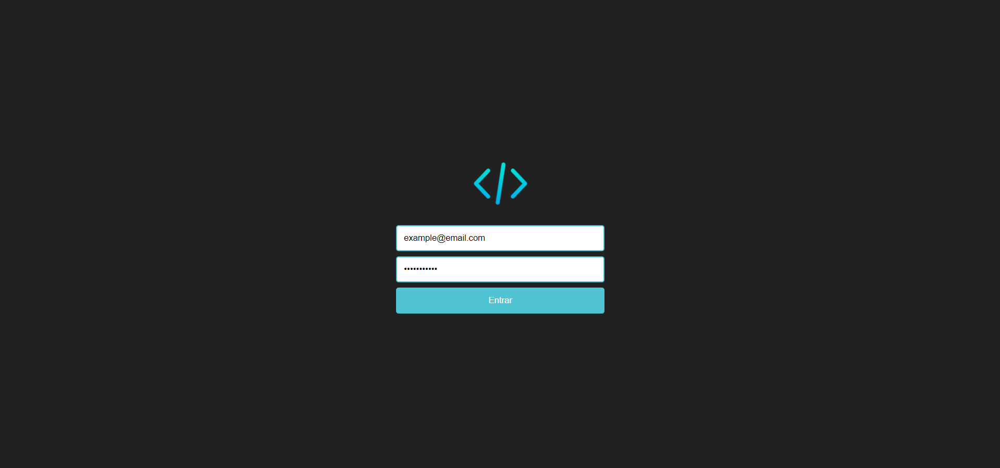

 
  
  

    <a href="#-tecnologias">Tecnologias</a>
</a>&nbsp;&nbsp;&nbsp;|&nbsp;&nbsp;&nbsp;
    <a href="#memo-licença">Licença</a>
  

  
   
  
  

    
  

  
  
  
  ## 🚀 Tecnologias
  
  Esse projeto foi desenvolvido com as tecnologias:
  
  
  
  
  ## 💻 Projeto
  
Uma página de Login simples.
    
   o entuito do projeto é testar os meus primeiros passos com ReactJS, e entender o Styled-Components
  
  
  ## :memo: Licença
  
  Esse projeto está sob a licença MIT. Veja o arquivo [LICENSE](LICENSE.md) para mais detalhes.
  
  ---
  
  By Victor Rosa 
  </body>
  </html>
